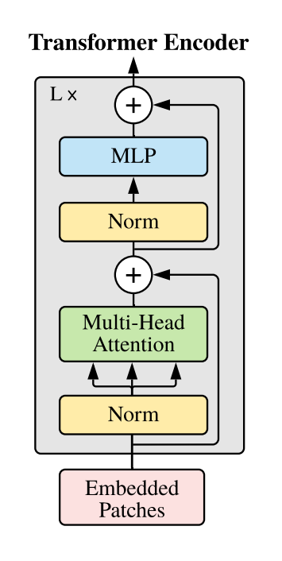
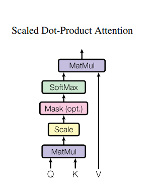
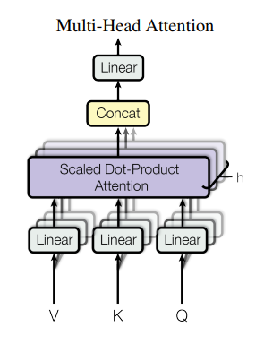
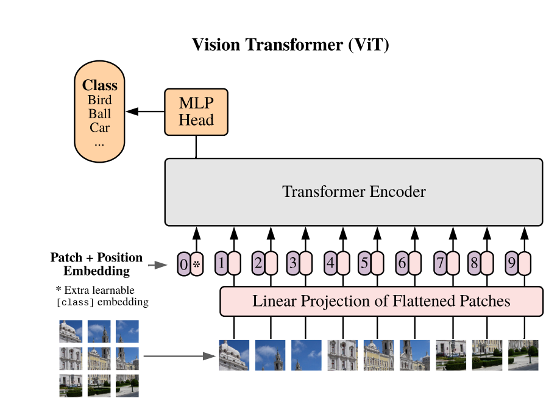
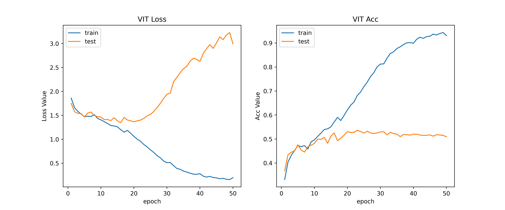
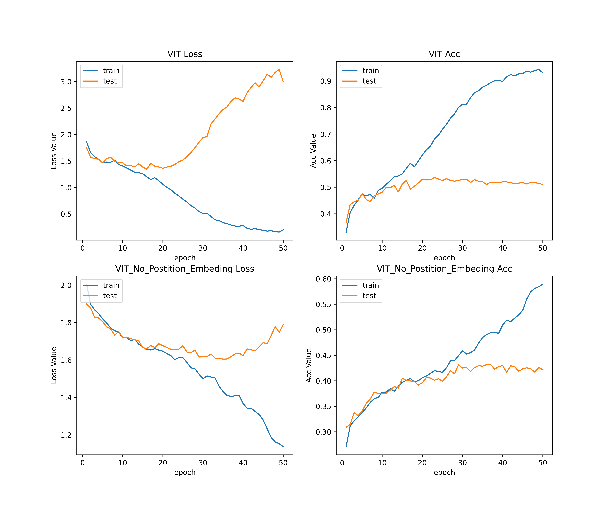
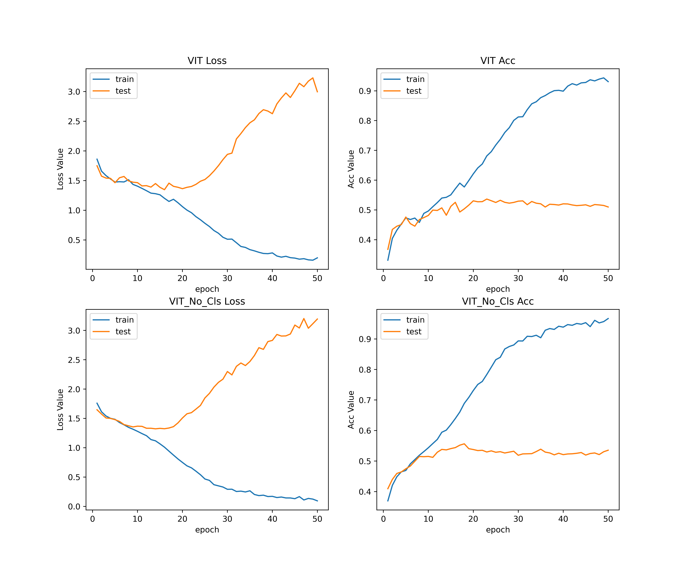
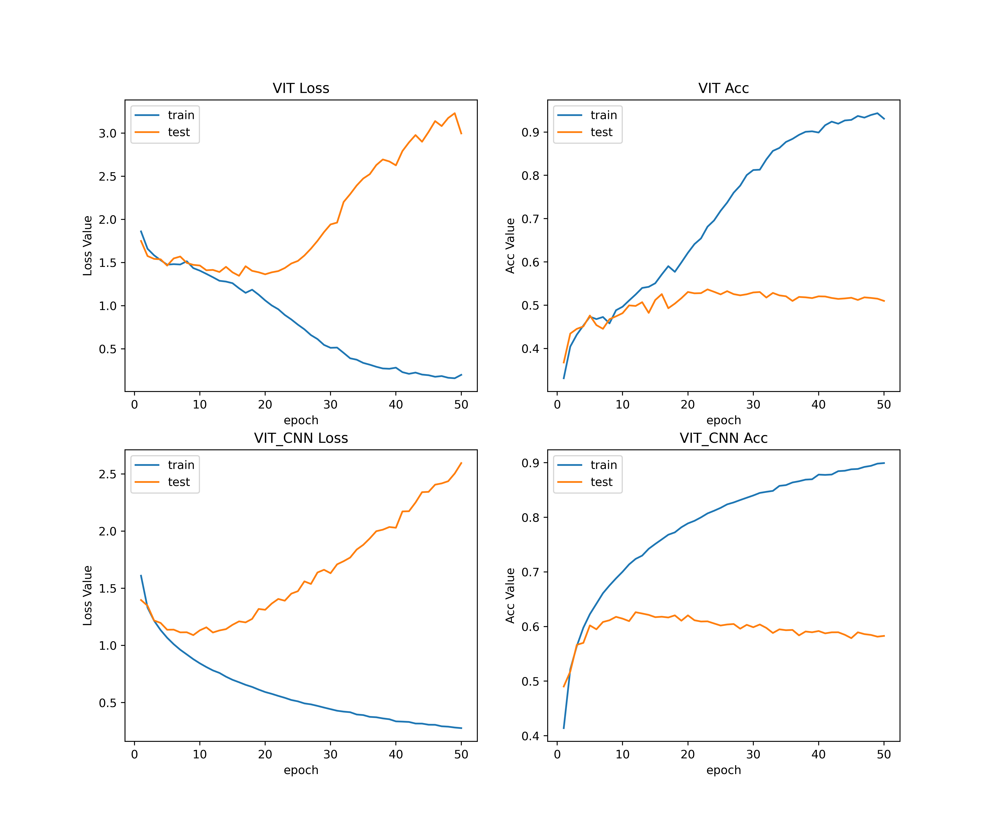
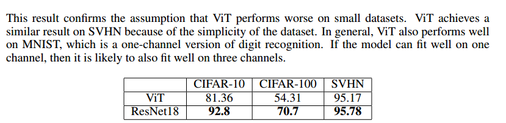

# Vision Transformer
## 代码实现
代码实现参考以下库与网站:
- https://github.com/google-research/vision_transformer 
- https://github.com/Kedreamix/Pytorch-Image-Classification
- https://zh.d2l.ai/
- https://pytorch.org/tutorials/beginner/blitz/cifar10_tutorial.html
### Attention[^2]
Vision Teansformer主要用了Transformer中的Encoder部分。



> 具体实现可以见[Encoder.py](Encoder.py)

#### DotProductAttention


Attention $(Q, K, V)$ = softmax( $\frac{QK^T}{\sqrt{d_k}}$ )V

Transformer用的是缩放点积注意力，这里用的是矩阵乘法，除以根号dk防止内积过大，使得经过softmax后梯度过小，不利于反向传播。

> 具体实现可以见[DotProductAttention.py](DotProductAttention.py)

#### MultiHeadAttention

Multi-head Attention其实就是多个Self-Attention结构的结合，每个head学习到在不同表示空间中的特征。

> 具体实现可以见[MultiHeadAttention.py](MultiHeadAttention.py)

#### AddPositionEmbs
Vision Transformer中，使用绝对位置编码，他也是个可以学习的参数。

> 具体实现可以见[AddPositionEmbs.py](AddPositionEmbs.py)
#### MlpBlock
对应Transformer中的MLP部分，包括两个全连接层，其中隐藏层大小推荐为输入输出的4倍。

> 具体实现可以见[MlpBlock.py](MlpBlock.py)

### Vision Transformer[^1]
#### PatchEmbed
> The standard Transformer receives as input a 1D sequence of token embeddings. To handle 2D images, we reshape the image into a sequence of flattened 2D patches.

由于Transformer输入是1D序列，为了处理2D图像，我们将其重新排列为2D块的序列。首先用卷积核扫描图像，将图像分成16x16块，然后将块展平为序列。

> 具体实现可以见[PatchEmbed.py](PatchEmbed.py)
#### VisionTransformer


> 具体实现可以见[VisionTransformer.py](VisionTransformer.py)

## 部分实验与结果
### 结果
```
====================================================================================================
Layer (type:depth-idx)                             Output Shape              Param #
====================================================================================================
VisionTransformer                                  [2, 10]                   2,304
├─PatchEmbed: 1-1                                  [2, 4, 768]               --
│    └─Conv2d: 2-1                                 [2, 768, 2, 2]            590,592
│    └─LayerNorm: 2-2                              [2, 4, 768]               1,536
├─Encoder: 1-2                                     [2, 5, 768]               --
│    └─AddPositionEmbs: 2-3                        [2, 5, 768]               3,840
│    └─Dropout: 2-4                                [2, 5, 768]               --
│    └─Sequential: 2-5                             [2, 5, 768]               --
│    │    └─Encoder1DBlock: 3-1                    [2, 5, 768]               7,083,264
│    └─LayerNorm: 2-6                              [2, 5, 768]               1,536
├─Identity: 1-3                                    [2, 768]                  --
├─Linear: 1-4                                      [2, 10]                   7,690
====================================================================================================
Total params: 7,690,762
Trainable params: 7,690,762
Non-trainable params: 0
Total mult-adds (Units.MEGABYTES): 18.92
====================================================================================================
Input size (MB): 0.02
Forward/backward pass size (MB): 0.90
Params size (MB): 30.75
Estimated Total Size (MB): 31.68
====================================================================================================
```


复现的模型使用CIFAR10数据集进行训练，在测试集的结果可以达到50%左右，这并不很好，与论文存在差距，可能的原因是论文使用了大数据集预训练。

### PositionEmbedings作用

> As we can see, while there is a large gap between the performances of the model with no positional embedding and models with positional embedding, there is little to no difference between different ways of encoding positional information. 

Vision Transformer 采用绝对位置编码的形式化，并且使用了可以学习的方式，通过实验，我们验证了加入位置编码后，模型性能确实有比较显著的提升，对于不同时间编码方式，由于时间原因，并没有实验。
###  CLASS TOKEN



结合论文我们看到使不使用class token对结果没有很大影响，通过调整得到合适的学习率，可以达到差不多的效果。

### 与CNN对比

通过对比，我们可以看到，Vision Transformer 相对于CNN反而精度更差了，对于这个异常的结果，我给出以下猜想
- Vision Transformer 模型较为复杂，而我们使用的CIFAR10数据集过于小，所以随着训练次数增多，模型出现过拟合现象，而CNN模型较为简单，所以可以拟合的比较好。对于这个猜想，原文是这样说的。
> Vision Transformers overfit more than ResNets with comparable computational cost on smaller datasets. For example, ViT-B/32 is slightly faster than ResNet50; it performs much worse on the 9M subset, but better on 90M+ subsets.

同时我也找了另一篇论文[^3]。

> one major drawback of vision transformer is its bad performance on small-scale datasets. Traditional CNN can be trained to make high accuracy predictions on the test dataset,
and their accuracy increases as we increase the number of parameters and layers. On the other hand, vision transformers usually have poor performance when trained on small datasets. Existing Methods such as Shifted Patch Tokenization (SPT) and Locality Self-Attention (LSA) are proven to improve the transformers’ accuracy on small datasets, yet their accuracy is still lower than CNN’s
- 我对于模型并没有调优或者实现存在一些不足，也有可能是没有做数据增强，所以可能存在一些问题。对于这个猜想，我找到一篇论文[^3]，结合其论文，我认为的复现还存在不足。

  
[^1]: [An Image is Worth 16X16 Words: Transformers for Image Recognisation at Scale](https://arxiv.org/abs/2010.11929)
[^2]: [Attention Is All You Need](https://arxiv.org/abs/1706.03762)
[^3]: [Understanding Why ViT Trains Badly on Small
Datasets: An Intuitive Perspective](https://arxiv.org/abs/2302.03751)